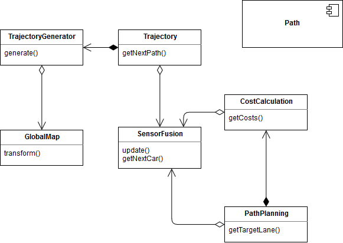
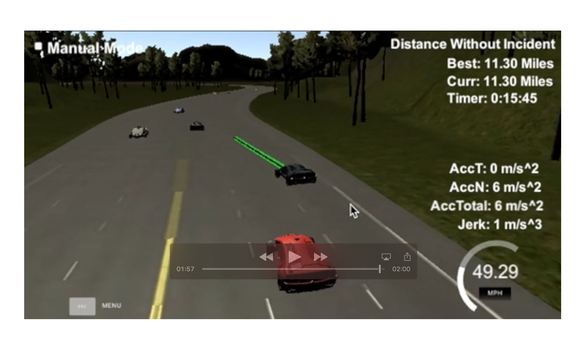

# Path-Planning-Project
   
In this project the goal is to safely navigate around a virtual highway with other traffic that is driving +-10 MPH of the 50 MPH speed limit. The car's localization and sensor fusion data is provided. There is also a sparse map list of way points around the highway. The car should try to go as close as possible to the 50 MPH speed limit, which means passing slower traffic when possible, note that other cars will try to change lanes too. The car should avoid hitting other cars at all cost as well as driving inside of the marked road lanes at all times, unless going from one lane to another. The car should be able to make one complete loop around the 6946m highway. Since the car is trying to go 50 MPH, it should take a little over 5 minutes to complete 1 loop. Also the car should not experience total acceleration over 10 m/s^2 and jerk that is greater than 50 m/s^3.

## Details

The car uses a perfect controller and will visit every (x,y) point it receives in the list every .02 seconds. The units for the (x,y) points are in meters and the spacing of the points determines the speed of the car. The vector going from a point to the next point in the list dictates the angle of the car. Acceleration both in the tangential and normal directions is measured along with the jerk, the rate of change of total Acceleration. The (x,y) point paths that the planner receives should not have a total acceleration that goes over 10 m/s^2, also the jerk should not go over 50 m/s^3.

There will be some latency between the simulator running and the path planner returning a path, with optimized code usually its not very long maybe just 1-3 time steps. During this delay the simulator will continue using points that it was last given.

## Solution



On initialization the GlobalMap will load the provided map data. GlobalMap provides methods to convert Cartesian Coordinates in Frenet coordinates.
The SensorFusion class takes the raw data of the road from the simulator. The Path component contains some Path and CarState classes as well as some helper functions. The simulator data corresponding to the car itself will be stored in a CarState object.

Every cycle the Trajectory class will be called to generate the next path. Before the Trajectory class calls the generate() method in the TrajectoryGenerator it will check if there is a car ahead in the current lane and adjust if necessary the target speed.

The next way points within the path will be generated by the TrajectoryGenerator. The generate() method receives the current car state, the previous path, the target speed as well as the target lane and returns the next 50 way points for the simulator.

The target lane will be calculated by the PathPlanning class. It uses the CostCalculation class to calculate the cost for every lane and returns the lane with the lowest costs. The cost calculation depends on the car distances ahead and behind the current Frenet s-position as well as the other cars velocities.

The Trajectory class checks if the given target lane results in a lane change and if it's safe to handle by checking the distance to the previous and next car within the target lane. If it's not safe to change, the target lane will be reseted to the current lane.

[](./doc/PathPlanningResult.mp4)


## Simulator
You can download the Term3 Simulator BETA which contains the Path Planning Project from the [releases tab](https://github.com/udacity/self-driving-car-sim/releases).

## Basic Build Instructions

1. Clone this repo.
2. Make a build directory: `mkdir build && cd build`
3. Compile: `cmake .. && make`
4. Run it: `./path_planning`.

## Dependencies

* cmake >= 3.5
 * All OSes: [click here for installation instructions](https://cmake.org/install/)
* make >= 4.1
  * Linux: make is installed by default on most Linux distros
  * Mac: [install Xcode command line tools to get make](https://developer.apple.com/xcode/features/)
  * Windows: [Click here for installation instructions](http://gnuwin32.sourceforge.net/packages/make.htm)
* gcc/g++ >= 5.4
  * Linux: gcc / g++ is installed by default on most Linux distros
  * Mac: same deal as make - [install Xcode command line tools]((https://developer.apple.com/xcode/features/)
  * Windows: recommend using [MinGW](http://www.mingw.org/)
* [uWebSockets](https://github.com/uWebSockets/uWebSockets)
  * Run either `install-mac.sh` or `install-ubuntu.sh`.
  * If you install from source, checkout to commit `e94b6e1`, i.e.
    ```
    git clone https://github.com/uWebSockets/uWebSockets 
    cd uWebSockets
    git checkout e94b6e1
    ```
